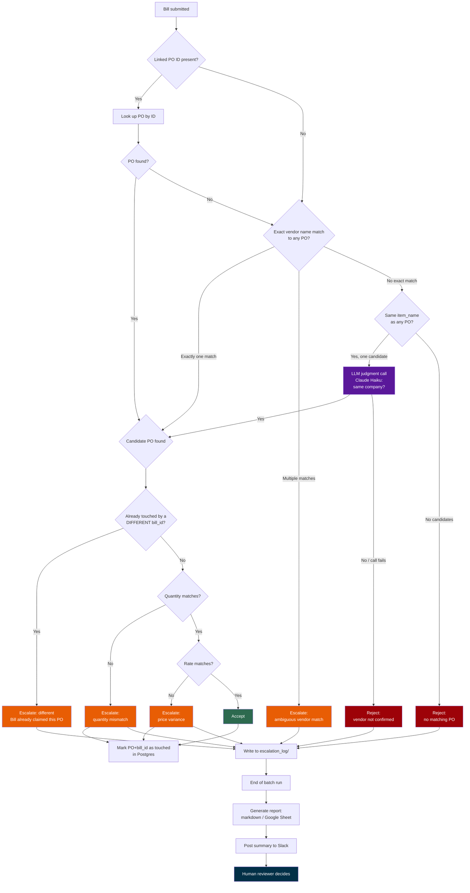

# Invoice Exception Handler

An automated PO/Bill matching system that accepts clean invoices, flags exceptions for human review, and rejects invalid or duplicate submissions ~ a deterministic rule engine with one narrowly-scoped LLM judgment call for the single case rules alone can't resolve.

## Why

Manual invoice matching doesn't scale ~ most invoices are fine, so the real cost is a human checking 100 to catch the 5 that aren't. This system removes the 95 clean cases from a person's plate, surfacing only what needs judgment. It also serves as proof-of-work: building *evaluated* AI systems ~ golden datasets, regression testing, cost/accuracy tradeoffs ~ not just "AI that does a task."

## What

Three verdicts, per Bill:

- **Accept** ~ vendor, quantity, rate all match. No human involved.
- **Reject** ~ no matching PO exists at all.
- **Escalate** ~ something doesn't match cleanly (price, quantity), or a different Bill has already touched this PO; a human decides.

## How (Architecture)

Not "an AI agent" in the sense of an LLM deciding everything. A rule engine handles the overwhelming majority of cases ~ deterministic vendor/PO matching, quantity and rate checks, Postgres-backed duplicate detection keyed on PO + bill ID (not PO alone, so a legitimate corrected resubmission of the same Bill still goes through, while a different Bill claiming an already-touched PO escalates). **One** isolated step calls an LLM (Claude Haiku): fuzzy vendor-name matching, recognizing "Aurelius Tech" and "Aurelius Technologies Ltd" as the same company when an exact match fails. Reaching for an LLM only where genuine judgment is needed ~ not by default ~ was a deliberate choice.

The model for that one step was chosen by measurement, not assumption ~ see comparison below.

Live data was meant to come from a QuickBooks sandbox; a persistent, platform-level OAuth issue blocked it throughout, so testing runs on hand-written JSON fixtures matching QuickBooks' real data shape instead. Stated plainly, not hidden ~ this remains open, not solved.



## Human-in-the-loop design

Escalations don't block the pipeline. Every case is logged ~ bill ID, PO ID, both vendor names, timestamp, reason ~ and the system moves to the next invoice immediately. At the end of a batch, a report is generated and delivered to a reviewer via Google Sheets and Slack. Decisions happen at the boundary of a run, never mid-flow.

## Testing strategy

**Golden dataset (6 cases)** ~ one hand-verified case per category. The reference standard; if these fail, something fundamental broke.

**Regression suite (107 cases)** ~ 70 clean, 8 price variance, 8 quantity mismatch, 6 fuzzy vendor match, 4 validation failure, 4 duplicate, 3 vendor-name bias-check cases, 1 duplicate-after-escalation adversarial case ~ generated to confirm the system holds at scale, not just on hand-picked examples.

Both run as real pytest assertions ~ a failure names exactly what was expected versus what came back, not a manual read of printed output.

### Eval checklist ~ applicable to this build

- [x] Golden dataset
- [x] Regression testing (results stored, re-run after every change)
- [x] LLM-as-judge (fuzzy vendor-name matching)
- [x] Bias check on the judge (3 cases confirming it correctly says "no" to similar-but-different companies, not just "yes" to everything)
- [ ] Grounding/citation check ~ not applicable, no retrieval step in this system
- [x] Adversarial case (a different Bill claiming an already-escalated PO with now-clean numbers)
- [x] Human review queue (structured escalation log, delivered via Sheets + Slack)
- [x] Cost-quality comparison (Ollama 3B vs. 7B vs. Haiku, real measured data)
- [x] Drift check (weekly scheduled re-run against the frozen fixture, results stored per run, not overwritten)
- [x] CI/CD gate (GitHub Actions, every push)
- [x] Plain-English write-up (this document)
- [x] Public eval report (this repo)
- [x] Decision-to-result link (model comparison directly decided Haiku as default)

### Deferred to production ~ not applicable to a portfolio-stage build

These require real production traffic or users to mean anything; faking them would be worse than skipping them. Planned once this system has live traffic:

- **Shadow deployments** ~ running a new version silently alongside the live one, comparing outputs before switching over
- **Competitor benchmarking** ~ testing the same cases against a rival product
- **Broader adversarial/jailbreak evals** ~ this system has no chat surface to attack; production would still warrant testing malformed or deliberately misleading invoice data beyond the one case here
- **Quantitative user trust metrics** ~ override rate, repeat-usage rate; meaningless without real reviewers using the system over time

## Model comparison ~ cost, latency, accuracy

| Model | Accuracy | Latency | Cost |
|---|---|---|---|
| Ollama `qwen2.5:3b` | Wrong on the real case | Seconds | Free |
| Ollama `qwen2.5:7b` | Correct | ~12 min, crashed the 8GB test machine | Free, impractical |
| Claude Haiku | Correct | Seconds | Fractions of a cent per call |

Haiku is the default ~ the only option that was both correct and practical. A measured result, not a guess.

## Project structure

```
agent.py                          ~ core matching/decision logic
fetch_cases.py, qbo_client.py      ~ QuickBooks integration layer (blocked, see above)
demofixture1.json                 ~ golden dataset (6 cases)
fixture_100.json                  ~ regression suite (107 cases)
test_agent.py, test_agent_100.py  ~ pytest suites
model_cost_latency_comparison.py  ~ Ollama vs. Haiku, real measured output
send_escalation_report.py         ~ writes to Google Sheets, posts to Slack
requirements.txt                  ~ dependencies
.gitignore                        ~ excludes .env, credentials, venv, local state
.github/workflows/test.yml        ~ CI: tests on every push; weekly drift check; Slack/Sheets on manual trigger only
escalation_log/                   ~ structured log of every escalated/rejected case
run_fixture_test1.py              ~ early standalone fixture runner, superseded by the pytest suites
```

## Running it

```bash
pip install -r requirements.txt
docker start ieh-postgres

pytest test_agent.py -v
pytest test_agent_100.py -v
python3 model_cost_latency_comparison.py
python3 send_escalation_report.py
```

## Known limitations

- QuickBooks live sandbox never resolved ~ platform-side OAuth issue, not a code issue
- No API layer ~ validated at the logic layer directly, not over HTTP; a hard requirement for the next project
- Single-line POs/Bills only
- Slack/Sheets delivery is manual-trigger by design, not automatic on every push
- Haiku's exact model version isn't yet pinned in results ~ needed before treating scores as long-term comparable
